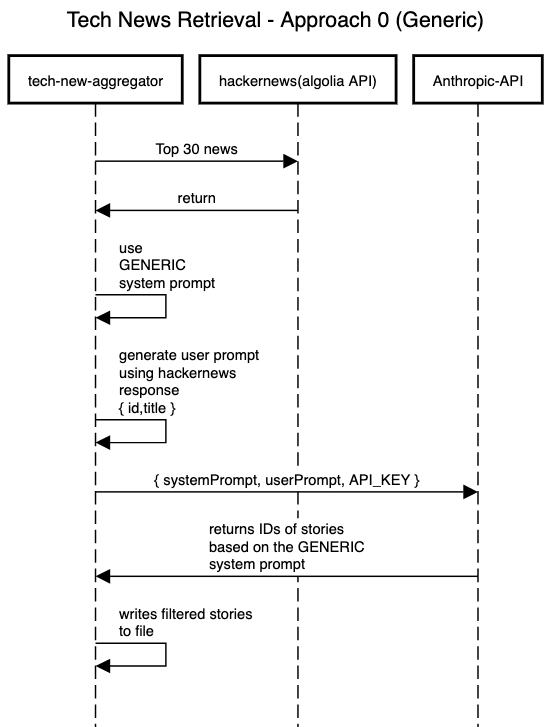
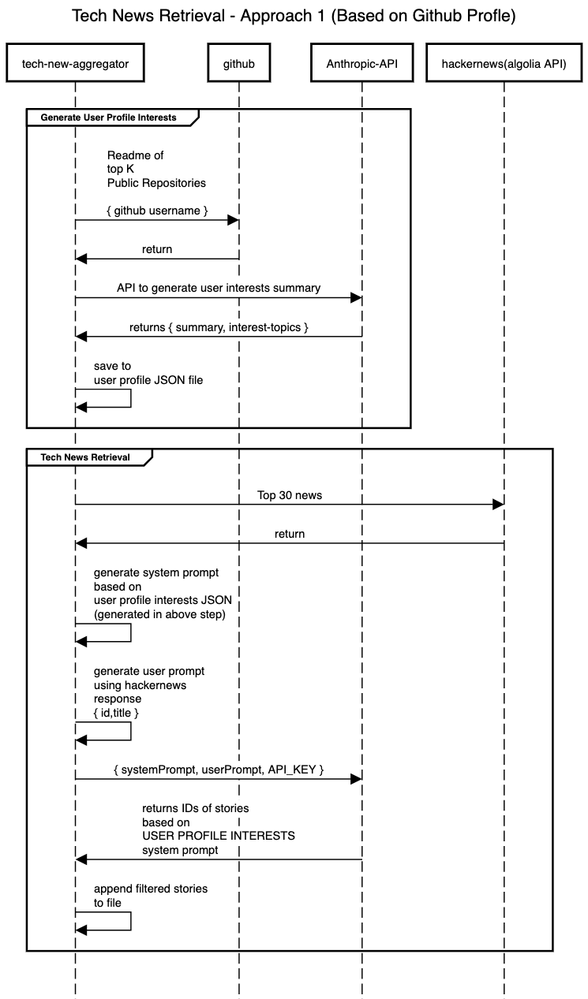
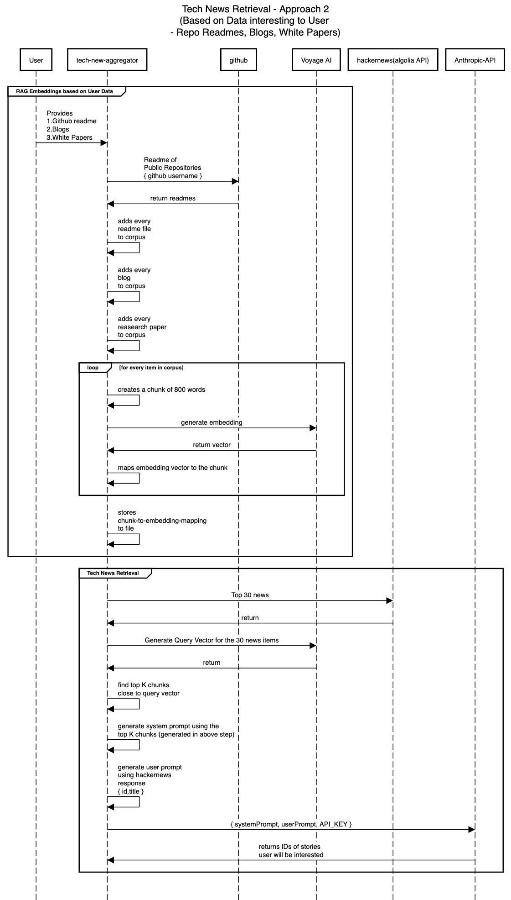

## Requirements

- Find the trending HackerNews articles users will be interested to read
- Update the filtered list of items every N hours

## Architecture

### Approach 1
---

#### Solution
Classify whether an article is a CS Tech Blog or not using `Generic "CS Technical" filter`

#### Sequence Diagram



### Approach 2
---

#### Solution

##### Step 1
- Extract `user interests` from public Github Profile
- Github profile username is required for this

##### Step 2
- Filter news items based on the `user interests` extracted from Github repos' readme files

#### Sequence Diagram



#### Notes
- The prebuild step distills READMEs into `profile/user_context.json` and the classify run reads that artifact. This is a *lossy proxy*, not a faithful replay of "what Claude would extract if we passed the raw READMEs into the classify call directly"
— Distillation drops nuance
- We accept this trade for
	- Cost Reduction
		- distilled profile JSON ensures reduced content being added to the prompt and not the entire bunch of readmes
		- this reduces the input tokens and hence cost
	- Stability
		- The interests profile is generated once currently
		- If this is generated during every run, then this would mean we would have a slightly different version of "user profile interests" as LLM output is non-deterministic and can vary slightly everytime
	- Inspectability
		- The flow is inspectable due to the artifact - `user profile interests json` file that is generated
		- Without the artifact, the only observable is the final ID list

### Approach 3 - Use RAG
---

#### Solution

- Make use of all the data available for the user
	- Readmes of repositories created by user
	- Blogs written by user in various platforms (medium, substack)
	- Reasearch papers read by user
- Then extract his interests to retrieve the news items the user will be interested int

##### Step 1
As you can see, the number of resources belonging to user can increase to a huge number.

As distilling all the available data to create a `user interests` can be very lossy here.

Hence we use **RAG (Retrieval Augmented Generation)** to build the user embeddings in the first step.

We use VoyageAI for this purpose of generating embeddings based on the user data

##### Step 2
When the script tries to filter the interested news items
- Use the embeddings to find the correct data to be added to the Claude's prompt
	- This in turn depends on the list of news items returned by Algolia API
- This prompt is expected to rightly classify the news items that user will be interested in

#### Sequence Diagram



#### Notes
- New dependency
	- Voyage AI
		- In Step 1 - For creating RAG embeddings
		- In Step 2 - For creating query vector based on news items

## Run modes (arms)

- The classifier flow is selected **explicitly** by an `arm` argument.
- Each arm picks exactly one `UserProfile` initialization and one classification flow.
- Each of the classification flow errors when its required data is absent rather than silently falling back.

| arm | UserProfile | Flow | Errors if… |
|-----|-------------|------|------------|
| `0` | none | generic/static "technical CS" prompt | never — production default |
| `1` | `summary` + `interests` from `profile/user_context.json` | interests injected into the prompt | the distilled JSON is missing (run `prebuild` first) |
| `2` | top-k corpus excerpts retrieved for the batch being classified | excerpts inlined into the prompt as evidence of the reader's interests | `profile/corpus_index.json` is missing, or retrieval fails (run `embed` first) |

```bash
# Approach 1
go run .                # normal run, arm 0 (default; cron-safe)
go run . eval 0         # eval under arm 0 (arm is REQUIRED for eval)

# Approach 2
go run . prebuild       # regenerate profile/user_context.json (see below)
go run . 1              # normal run, arm 1 (interests) — needs prebuild's JSON
go run . eval 1         # eval under arm 1

# Approach 3
go run . embed          # regenerate profile/corpus_index.json (see below)
go run . 2              # normal run, arm 2 (RAG) — needs embed's corpus index
go run . eval 2         # eval under arm 2 — slow on Voyage's free tier, see below
```

## Eval - Execution results

#### Confusion matrix
| Metric | Approach 0 | Approach 1 | Approach 2 |
|--|--|--|--|
| TP (hit, flagged & relevant) | 14 | 4 | 14 |
| FP (false alarm, flagged but dud) | 120 | 8 | 70 |
| TN (correct skip) | 186 | 298 | 236 |
| FN (miss, skipped but relevant) | 21 | 31 | 21 |

#### Metrics

| Metric | Approach 0 | Approach 1 | Approach 2 |
|--|--|--|--|
| Precision (of flagged, % good) | 0.1045 | 0.3333 | 0.1667 |
| Recall    (of good, % caught) | 0.4000 | 0.1143 | 0.4000 |

## Setup

### Secrets & environment

The project needs two secret API keys and one non-secret config value:

| Name | Type | Used by | Where it lives |
|------|------|---------|----------------|
| `ANTHROPIC_API_KEY` | secret | All Approaches | macOS Keychain |
| `VOYAGE_API_KEY` | secret | Approach 3 | macOS Keychain |
| `GITHUB_USERNAME` | non-secret | Approach 2 | `.env` (see `.env.example`) |

### How to initialize the API keys (macOS Keychain)?

**Store the keys (one-time):**
```bash
security add-generic-password -a "$USER" -s "ANTHROPIC_API_KEY" -w "your-anthropic-key-here"
security add-generic-password -a "$USER" -s "VOYAGE_API_KEY"    -w "your-voyage-key-here"
```

**Verify they work:**
```bash
security find-generic-password -a "$USER" -s "ANTHROPIC_API_KEY" -w
security find-generic-password -a "$USER" -s "VOYAGE_API_KEY"    -w
```

## Run script

Use any one of the modes mentioned under the [Run modes](#run-modes-arms) section.
